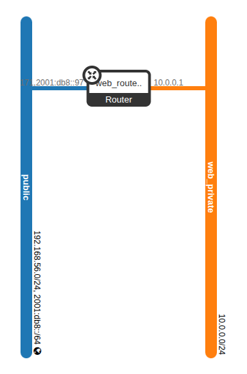
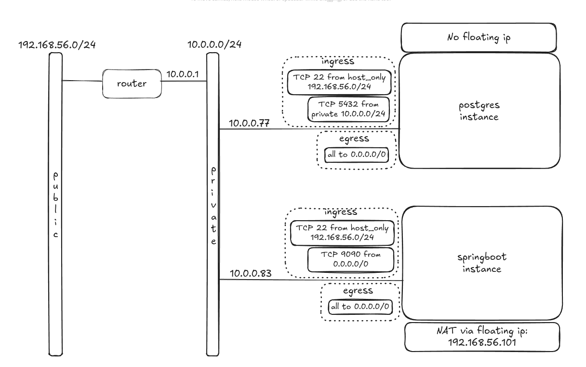
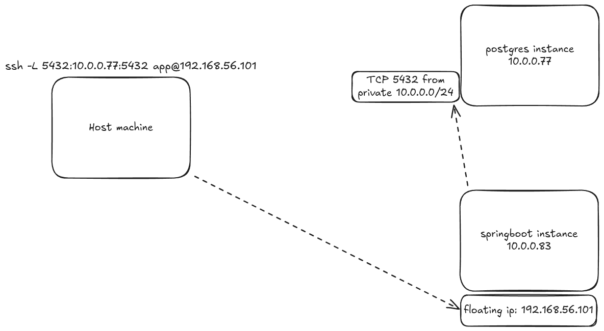

# AppDevstackDeployment

## 1) Prerequisites

### We assume we have an installed ubuntu VM with 2 Adapters
1. NAT (for internet access)
2. Host-only network (for the floating-IPs later, range 192.168.56.0/24) 

### We'll also be using this netplan config
Edit `/etc/netplan/10-enp0s8-static.yaml`:

```bash
network:
  version: 2
  renderer: networkd
  ethernets:
    enp0s8:
      dhcp4: false
      addresses: [192.168.56.10/24]
      nameservers:
        addresses: [8.8.8.8,8.8.4.4]
```
## 2) Devstack installation

### Add the `stack` user and give the necessary permissions

```bash
sudo useradd -s /bin/bash -d /opt/stack -m stack
sudo chmod +x /opt/stack
```

### Since this user will be making many changes to your system, it should have sudo privileges:

```bash 
echo "stack ALL=(ALL) NOPASSWD: ALL" | sudo tee /etc/sudoers.d/stack
sudo -u stack -i
```

### Install Git and download DevStack

```bash
sudo apt-get install git -y
git clone https://opendev.org/openstack/devstack
```
### Git clone project and copy `local.conf`
```bash
git clone https://github.com/PanayiotisPerdios/AppDevstackDeployment.git
sudo cp AppDevstackDeployment/local.conf devstack/
```
### Start the devstack install
```bash
cd devstack
./stack.sh
```

## 3) Devstack setup/configuration

### Source in as admin
```bash
source ~/devstack/openrc admin
```
### Create a project
```bash
openstack project create \
  --domain default \
  --description "Web App Project" \
  web_app
```
### Create a user on the project you created and give him the admin role

```bash
openstack user create --domain default --project web_app --password webpass webadmin1
openstack role add --project web_app --user webadmin1 admin
```
### Download `web_app-openrc` file from Horizon then source it

```bash
source web_app-openrc
```

### Creat a private network
```bash
openstack network create web_private
```

### Create a subnet on the private network
```bash
openstack subnet create \
  --network web_private \
  --subnet-range 10.0.0.0/24 \
  --dns-nameserver 8.8.8.8 \
  --dns-nameserver 8.8.4.4 \
 web_private_subnet
```

### Create a router and connect it between your public and private network
```bash
openstack router create web_router
```
```bash
openstack router set web_router --external-gateway public
```
```bash
openstack router add subnet web_router web_private_subnet
```

### Now the network topology should look like this:



### Add a security group and it's rules for the postgres instance 

```bash
openstack security group create postgres-sg --description "Postgres Security Group"
```
```bash
# Allow SSH from host-only network
openstack security group rule create postgres-sg \
  --protocol tcp --dst-port 22 \
  --ingress --remote-ip 192.168.56.0/24
```

```bash
# Allow PostgreSQL traffic from private subnet
openstack security group rule create postgres-sg \
  --protocol tcp --dst-port 5432 \
  --ingress --remote-ip 10.0.0.0/24
```

```bash
# Allow all egress (it exists by default but explicitly if needed)
openstack security group rule create postgres-sg \
  --egress --protocol any --remote-ip 0.0.0.0/0
```

### Add a security group and it's rules for the springboot instance 

```bash
openstack security group create springboot-sg --description "Springboot Security Group"
```

```bash
# Allow SSH from host-only network
openstack security group rule create springboot-sg \
  --protocol tcp --dst-port 22 \
  --ingress --remote-ip 192.168.56.0/24
```

```bash
# Allow HTTP port 9090 from anywhere (0.0.0.0/0)
openstack security group rule create springboot-sg \
  --protocol tcp --dst-port 9090 \
  --ingress --remote-ip 0.0.0.0/0
```

```bash
# Allow all egress (it exists by default but explicitly if needed)
openstack security group rule create springboot-sg \
  --egress --protocol any --remote-ip 0.0.0.0/0
```
### Setup and upload images
  by following the guide here: ([image_setup.md](image_setup.md))

### Create floating ip and assign it to the springboot instance
```bash
openstack floating ip create public
openstack server add floating ip springboot-image

```




### SSH tunneling to postgres db since it doesnt have a floating ip
```bash
ssh -L 5432:10.0.0.77:5432 app@192.168.56.101
```


## 4) Monitoring with Ceilometer

```bash
openstack metric resource list --type instance
```
```bash
openstack metric measures show \
  --resource-id <instance_id> \
  cpu_util
```

```bash
openstack metric measures show \
  --resource-id <instance_id> \
  memory.usage
```