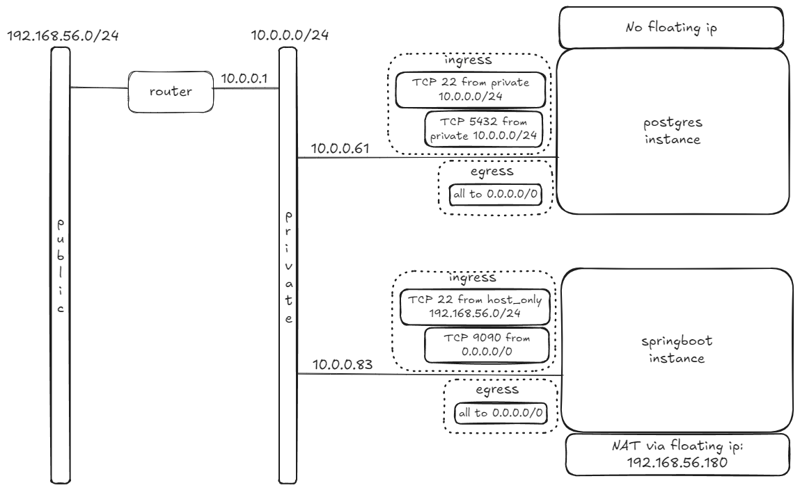
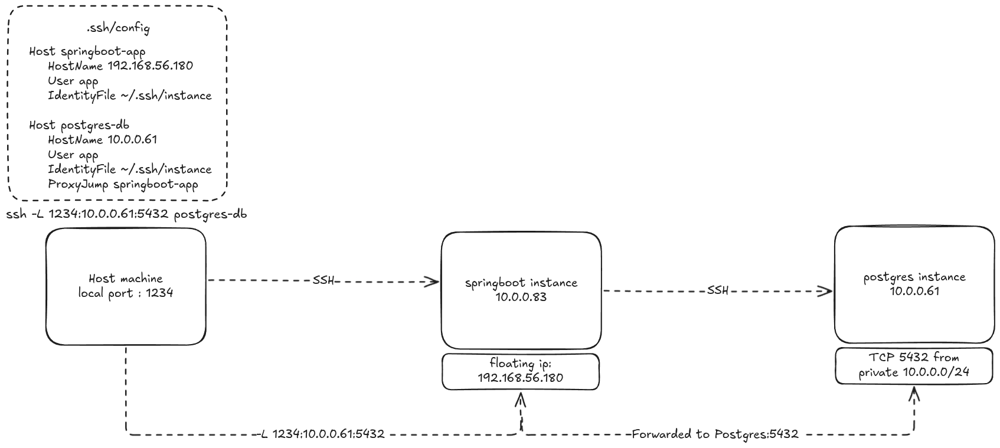

# AppDevstackDeployment

## 1) Prerequisites

### We assume we have an installed ubuntu VM with 2 Adapters
1. NAT (for internet access)
2. Host-only network (for the floating-IPs later, range 192.168.56.0/24) 

### We'll also be using this netplan config
Edit `/etc/netplan/10-enp0s8-static.yaml`:

```bash
network:
  version: 2
  renderer: networkd
  ethernets:
    enp0s8:
      dhcp4: false
      addresses: [192.168.56.10/24]
      nameservers:
        addresses: [8.8.8.8,8.8.4.4]
```
## 2) Devstack installation

### Add the `stack` user and give the necessary permissions

```bash
sudo useradd -s /bin/bash -d /opt/stack -m stack
sudo chmod +x /opt/stack
```

### Since this user will be making many changes to your system, it should have sudo privileges:

```bash 
echo "stack ALL=(ALL) NOPASSWD: ALL" | sudo tee /etc/sudoers.d/stack
sudo -u stack -i
```

### Install Git and download DevStack

```bash
sudo apt-get install git -y
git clone https://opendev.org/openstack/devstack
```
### Git clone project and copy `local.conf`
```bash
git clone https://github.com/PanayiotisPerdios/AppDevstackDeployment.git
sudo cp AppDevstackDeployment/local.conf devstack/
```
### Start the devstack install
```bash
cd devstack
./stack.sh
```

## 3) Devstack setup/configuration

### Source in as admin
```bash
source ~/devstack/openrc admin
```
### Create a project
```bash
openstack project create \
  --domain default \
  --description "Web App Project" \
  web_app
```
### Create a user on the project you created and give him the admin role

```bash
openstack user create --domain default --project web_app --password webpass webadmin1
openstack role add --project web_app --user webadmin1 admin
```
### Download `web_app-openrc` file from Horizon then source it

```bash
source web_app-openrc
```

### Creat a private network
```bash
openstack network create web_private
```

### Create a subnet on the private network
```bash
openstack subnet create \
  --network web_private \
  --subnet-range 10.0.0.0/24 \
  --dns-nameserver 8.8.8.8 \
  --dns-nameserver 8.8.4.4 \
 web_private_subnet
```

### Create a router and connect it between your public and private network
```bash
openstack router create web_router
```
```bash
openstack router set web_router --external-gateway public
```
```bash
openstack router add subnet web_router web_private_subnet
```

### Now the network topology should look like this:


### Add a security group and it's rules for the postgres instance 

```bash
openstack security group create postgres-sg --description "Postgres Security Group"
```
```bash
# Allow SSH from host-only network
openstack security group rule create postgres-sg \
  --protocol tcp --dst-port 22 \
  --ingress --remote-ip 10.0.0.0/24
```

```bash
# Allow PostgreSQL traffic from private subnet
openstack security group rule create postgres-sg \
  --protocol tcp --dst-port 5432 \
  --ingress --remote-ip 10.0.0.0/24
```

```bash
# Allow all egress (it exists by default but explicitly if needed)
openstack security group rule create postgres-sg \
  --egress --protocol any --remote-ip 0.0.0.0/0
```

### Add a security group and it's rules for the springboot instance 

```bash
openstack security group create springboot-sg --description "Springboot Security Group"
```

```bash
# Allow SSH from host-only network
openstack security group rule create springboot-sg \
  --protocol tcp --dst-port 22 \
  --ingress --remote-ip 192.168.56.0/24
```

```bash
# Allow HTTP port 9090 from anywhere (0.0.0.0/0)
openstack security group rule create springboot-sg \
  --protocol tcp --dst-port 9090 \
  --ingress --remote-ip 0.0.0.0/0
```

```bash
# Allow all egress (it exists by default but explicitly if needed)
openstack security group rule create springboot-sg \
  --egress --protocol any --remote-ip 0.0.0.0/0
```

### Setup and upload images
  by following the guide here: ([image_setup.md](image_setup.md))

### Create a floating ip and assign it to the springboot instance
```bash
openstack floating ip create public
openstack server add floating ip springboot-vm <floating-192.168.56.180ip-you-created>
```



## 4) Setup SSH tunnel with ProxyJump to postgres db 

We should avoid assigning a floating ip so we will use an ssh tunnel to acces the db
### Copy your private SSH devstack key to the springboot-app insatnce
```bash
scp -i .ssh/id_rsa .ssh/id_rsa app@<springboot-app-floating-ip>:/home/app/.ssh/id_rsa
```
### Give the neccessery permission
```bash
chmod 600 ~/.ssh/id_rsa
```
### Setup the `.ssh/config` 
```bash
Host springboot-app
    HostName <springboot-app-floating-ip>
    User app
    IdentityFile ~/.ssh/instance

Host postgres-db
    HostName <postgres-private-ip>
    User app
    IdentityFile ~/.ssh/instance
    ProxyJump springboot-app
```

### Then we run
```bash
ssh -L 1234:10.0.0.61:5432 postgres-db
```

#### Access the db from inside the postgres instance
```bash
psql -h localhost -p 5432 -U dbuser -d BloodDonors
``` 



## 5) Monitoring instances with Ceilometer

### Copy the ID of the instance
```bash
openstack server list
```
### Then run the following command for both instances to display their resources
```bash
openstack metric resource list | grep <instance-id>
openstack metric resource show  <instance-id>
```
```bash
openstack metric resource list --type instance
```
### You can also check individual information for each resource, like `cpu_util` and `memory.usage` etc
```bash
openstack metric measures show \
  --resource-id <instance-id> \
  cpu_util
```

```bash
openstack metric measures show \
  --resource-id <instance-id> \
  memory.usage
```

# Troubleshooting

## Common Errors

### If for whatever reason your springboot app cant communicate with your postgres instance, at the end of the file `/etc/postgresql/14/main/pg_hba.conf` add this line
```bash
# Allow Spring Boot VM to connect
host    BloodDonors     dbuser          <springboot-app-private-ip>/32           md5
```

## Helpful commands

### Inside the postgres instance,run this to check if the db and user have been created succesfully
```bash
sudo -u postgres psql -c "\du"
sudo -u postgres psql -c "\l"
```

### Inside the springboot instance,run this to check if the service is running nad is healthy
```bash
sudo systemctl status app.service
```

### Also if it the service fails use this command to check the logs 
```bash
journalctl -u app.service
```


