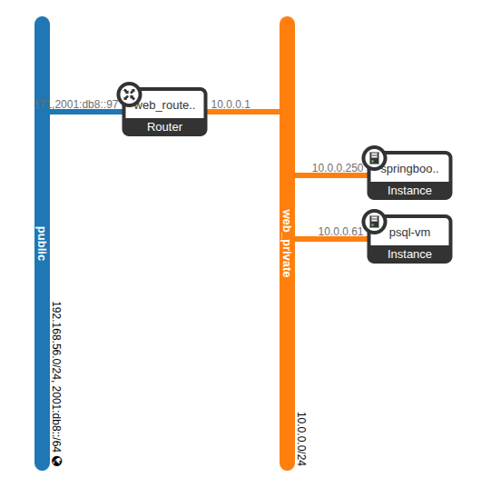

# OpenStack Deployment of Postgres DB and Springboot VM Images

## Prerequisites

- **Host** with QEMU & KVM (or use `-machine accel=tcg` if `/dev/kvm` is busy)  
- **cloud-image-utils** (for `cloud-localds`)  
- **libguestfs-tools** (for `virt-customize`)  
- **OpenStack** cloud & `openstack` CLI  
- **SSH** keypair on host (`~/.ssh/id_rsa` + `id_rsa.pub`)

---

## 1) Download & Prepare Base Images

1. **Download official Ubuntu Jammy Cloud Image**  
   ```bash
   wget https://cloud-images.ubuntu.com/jammy/20250516/jammy-server-cloudimg-amd64.img -O base-image.qcow2
    ```
2. Convert (if needed) & duplicate for DB/Web

```bash
# Install qemu-utils
sudo apt install qemu-utils
```

```bash
# Ensure QCOW2 format
qemu-img convert -f qcow2 -O qcow2 base-image.qcow2 base-image-fixed.qcow2
```
```bash
#Create two working images
cp base-image-fixed.qcow2 postgres-image.img
cp base-image-fixed.qcow2 springboot-image.img
cp base-image-fixed.qcow2 web-flask.img
```

## 2) Image setup
### 1. Install Dependencies

```bash
sudo apt-get update
sudo apt-get install -y genisoimage cloud-image-utils libguestfs-tools qemu-system-x86
```

### 2. Prepare `user-data.yml` & `meta-data-postgres.yml` & `meta-data-springboot.yml` & `user-data-postgres.yml`

#### user-data.yml

```bash
#cloud-config
users:
  - name: app
    ssh-authorized-keys:
      - ssh-rsa AAAA…your_public_key… app@host
    sudo: ['ALL=(ALL) NOPASSWD:ALL']
    shell: /bin/bash

package_update: true
package_upgrade: true
```

#### user-data-postgres.yml
```bash
#cloud-config
users:
  - name: app
    ssh-authorized-keys:
      - ssh-rsa AAAA…your_public_key… app@host
    sudo: ['ALL=(ALL) NOPASSWD:ALL']
    shell: /bin/bash

package_update: true
package_upgrade: true

runcmd:
  - echo '# Allow Spring Boot VM to connect' >> /etc/postgresql/14/main/pg_hba.conf
  - echo 'host    BloodDonors     dbuser          10.0.0.0/24           md5' >> /etc/postgresql/14/main/pg_hba.conf
  - systemctl restart postgresql
```

#### meta-data-postgres.yml

```bash
instance-id: springboot-vm
local-hostname: springboot
```

### Generate the NoCloud seed disk:

### for springboot app
```bash
cloud-localds seed-springboot.iso user-data.yaml meta-data-springboot.yaml
```

### for postgres
```bash
cloud-localds seed-postgres.iso user-data-postgres.yaml meta-data-postgres.yaml
```

### 3. Launch and test the postgres db image
1. Resize `postgres-image.img`
```bash
qemu-img resize postgres-image.img +2G
```

1. Bake in postgres db setup:
```bash
sudo virt-customize -a postgres-image.img --firstboot scripts/./firstboot-postgres.sh
```
2. Launch the postgres DB VM:
```bash
qemu-system-x86_64 \
  -enable-kvm -m 2048 \
  -drive file=postgres-image.img,if=virtio,format=qcow2 \
  -drive file=seed-postgres.iso,if=virtio,format=raw \
  -netdev user,id=net0,hostfwd=tcp::2222-:22,hostfwd=tcp::5432-:5432 \
  -device virtio-net,netdev=net0 \
  -nographic
```
### 4. Launch and test the springboot image
1. Resize `springboot-image.img`
```bash
qemu-img resize springboot-image.img +2G
```
2. Bake in springboot setup:

```bash
sudo virt-customize -a springboot-image.img --firstboot scripts/./firstboot-springboot.sh
```
3. Launch the springboot VM:
```bash
qemu-system-x86_64 \
  -enable-kvm -m 2048 \
  -drive file=springboot-image.img,if=virtio,format=qcow2 \
  -drive file=seed-postgres.iso,if=virtio,format=raw \
  -netdev user,id=net1,hostfwd=tcp::9090-:90,hostfwd=tcp::2223-:22 \
  -device virtio-net,netdev=net1 \
  -nographic
```
It is important to note that `app.service` may initially fail because the postgres db isn't ready yet, but that's intentional and it will function correctly later

## 3) Upload, Launch & SSH on OpenStack

### 1. Upload to Glance
```bash
openstack image create --file postgres-image.img --disk-format qcow2 --container-format bare --public postgres-image
openstack image create --file springboot-image.img --disk-format qcow2 --container-format bare --public springboot-image
```

### 2. Launch Instances

### for springboot app

```bash
openstack server create \
  --flavor ds1G \
  --image springboot-image \
  --network web_private \
  --security-group springboot-sg \
  --key-name my-ssh-key \
  --user-data user-data.yaml \
  springboot-vm
```

### for postgres db

```bash
openstack server create \
  --flavor ds1G \
  --image postgres-image \
  --network web_private \
  --security-group postgres-sg \
  --key-name my-ssh-key \
  --user-data user-data.yaml \
  psql-vm
```

## Important we need `--v4-fixed-ip=10.0.0.61` because the `firstboot-springboot.sh` is configured to connect to that postgres db 

### After that your network topology should look like this




### 3. Assign Floating IPs & Test

### for springboot app

```bash
FIP_DB=$(openstack floating ip create public -f value -c floating_ip_address)
openstack server add floating ip psql-vm $FIP_DB
ssh -i ~/.ssh/id_rsa app@$FIP_DB
```

### 4. SSH / HTTP into your VMs


### for springboot app

```bash
ssh -i ~/.ssh/id_rsa app@<springboot-app-floating_ip>
```

```bash
#Test by creating a user inside devstack VM
curl -X POST http://<your-server-ip>:<port>/api/auth/signup \
  -H "Content-Type: application/json" \
  -d '{"username":"john_doe","email":"john@example.com","password":"securePassword123","role":["donor"]}'
```
### for postgres db

You need to setup SSH tunneling with ProxyJump in order to SSH to it 
you can follow the guide here: ([README.md](README.md)) 

# Troubleshooting

## Common Errors

```bash
Error: HttpException: 502: Server Error for url: 
http://192.168.56.10/image/v2/images/e8491892-c971-470e-a3a7
-cc8964105f26/file, 502 Bad Gateway: Bad Gateway: The proxy server 
received an invalid: response from an upstream server.: 
Apache/2.4.52 (Ubuntu) Server at 192.168.56.10 Port 80
```
## This usually happens when the Glance disk quata is exceeded, so we need to increase the `image_limit`
```bash
openstack registered limit list
```
## Copy the `ID` of `image_size_total`
```bash
openstack registered limit set --default-limit 12000 <ID>
```
Now you can upload your images to Glance
